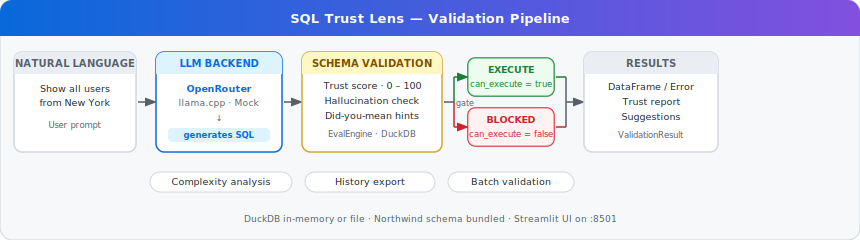
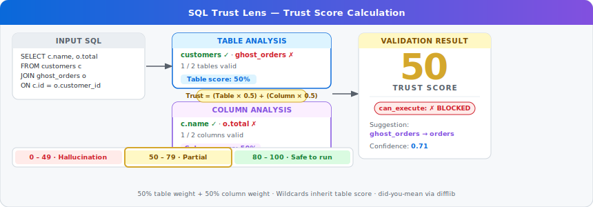

# SQL Trust Lens — Schema Validation for LLM-Generated SQL

> *Made autonomously using [NEO](https://heyneo.so) · [](https://marketplace.visualstudio.com/items?itemName=NeoResearchInc.heyneo)*

[](https://www.python.org/)
[](LICENSE)
[](tests/)

**Validate LLM-generated SQL against your live schema before it executes — catch hallucinated tables and columns, get a 0–100 trust score, and block unsafe queries automatically.**

LLMs confidently generate SQL that references tables and columns that do not exist. SQL Trust Lens intercepts those queries before they reach your database, scores them against the real schema, explains what is wrong, and only allows execution when the query is safe.

---

## How it works



1. A **natural language prompt** is sent to an LLM backend (OpenRouter, local llama.cpp, or a mock for offline use).
2. The LLM **generates SQL**. SQL Trust Lens immediately passes it to `EvalEngine`.
3. `EvalEngine` **validates** every table and column reference against the live DuckDB schema, computes a 0–100 trust score, flags hallucinated identifiers, and generates did-you-mean suggestions.
4. A **gate** checks `can_execute`: queries that fail schema validation are blocked before they touch the database.
5. Safe queries are executed and return a DataFrame; blocked queries surface a detailed trust report instead.

---

## Install

```bash
pip install -r requirements.txt
```

**Core dependencies:** `duckdb`, `difflib` (stdlib), `streamlit`, `openai` (for OpenRouter), `llama-cpp-python` (optional, for local inference).

---

## Quickstart

```python
from sql_trust_lens import EvalEngine

# Use the bundled Northwind schema (no database file required)
engine = EvalEngine()

# Or bring your own DuckDB file
# engine = EvalEngine(db_path="./my_database.db")

result = engine.validate_sql("SELECT name, city FROM customers WHERE city = 'London'")

print(result.trust_score)          # 100.0
print(result.valid_tables)         # ['customers']
print(result.invalid_tables)       # []
print(result.valid_columns)        # {'name': 'customers', 'city': 'customers'}
print(result.invalid_columns)      # {}
print(result.can_execute)          # True
print(result.confidence)           # 1.0
print(result.complexity.join_count)         # 0
print(result.complexity.complexity_label)   # 'simple'
print(result.issues)               # []

# Execute only when schema is valid
if result.can_execute:
    df = engine.execute_sql(result.sql)
    print(df)

engine.close()
```

---

## Trust Score



### Formula

```
trust_score = (table_component × 0.5 + col_component × 0.5) × 100

table_component = valid_tables / all_referenced_tables
col_component   = valid_columns / all_explicit_columns
                  (wildcard SELECT * inherits table_component)
```

Both components are weighted equally at 50%. A query must have all tables and all columns valid to reach 100.

### Score tiers

| Range | Label | Meaning |
|-------|-------|---------|
| 80 – 100 | Safe to run | All or nearly all references are valid |
| 50 – 79 | Partial | Some valid references; review suggestions |
| 0 – 49 | Hallucination | Major schema mismatch; execution blocked |

### Examples

| Query | Trust Score | Notes |
|-------|-------------|-------|
| `SELECT * FROM users` | **100%** | Table and columns valid |
| `SELECT * FROM fake_table` | **0%** | Table does not exist |
| `SELECT invalid_col FROM users` | **50%** | Table valid, column invalid |
| `SELECT name FROM usr` | **0%** | Table name is a typo (`usr` → `users`) |

---

## Hallucination Detection

```python
result = engine.validate_sql(
    "SELECT c.name, o.total FROM customers c JOIN ghost_orders o ON c.id = o.customer_id"
)

print(result.trust_score)      # 50.0
print(result.invalid_tables)   # ['ghost_orders']
print(result.valid_tables)     # ['customers']
print(result.invalid_columns)  # {'o.total': None}  — column can't be verified
print(result.suggestions)      # {'ghost_orders': 'orders'}
print(result.can_execute)      # False
print(result.issues)
# [
#   "Table 'ghost_orders' not found in schema",
#   "Did you mean: 'orders'?",
#   "Column 'total' could not be validated (unknown table alias 'o')"
# ]
```

`suggestions` is a dict of `{wrong_name: best_match}` built with Python's `difflib.get_close_matches`. It catches common typos such as `usr` → `users`, `oder` → `orders`, and `produts` → `products`.

---

## SQL Complexity

Every `ValidationResult` carries a `ComplexityMetrics` object:

```python
result = engine.validate_sql("""
    SELECT c.name, COUNT(o.id) AS total_orders
    FROM customers c
    JOIN orders o ON c.id = o.customer_id
    WHERE c.city = 'London'
    GROUP BY c.name
""")

m = result.complexity
print(m.join_count)          # 1
print(m.subquery_count)      # 0
print(m.aggregation_count)   # 1
print(m.where_conditions)    # 1
print(m.complexity_score)    # 35
print(m.complexity_label)    # 'moderate'
```

### Complexity formula

```
score = min(100,
    join_count        × 20
  + subquery_count    × 30
  + aggregation_count × 10
  + where_conditions  × 5
)
```

| Score | Label |
|-------|-------|
| 0 – 29 | simple |
| 30 – 59 | moderate |
| 60 – 100 | complex |

---

## Web UI

```bash
streamlit run app.py
# Opens on http://localhost:8501
```

The Streamlit interface provides:

- **Chat input** — type a natural language question and receive generated + validated SQL.
- **Schema browser** — explore all tables and columns in the connected database.
- **Trust bar** — colour-coded 0–100 gauge updated on every query.
- **Execution results** — DataFrame view of query output when `can_execute` is true.
- **History export** — download the session's validation history as JSON or CSV.

Environment variables that control the UI:

| Variable | Default | Description |
|----------|---------|-------------|
| `APP_TITLE` | `SQL Trust Lens` | Page title shown in the browser tab |
| `APP_PORT` | `8501` | Streamlit server port |
| `MAX_HISTORY` | `50` | Maximum entries kept in session history |
| `ENABLE_SUGGESTIONS` | `true` | Toggle did-you-mean hints in the UI |

---

## NL → SQL Pipeline

```python
from sql_trust_lens import EvalEngine, LLMBackend

engine = EvalEngine()
llm    = LLMBackend()   # reads USE_MOCK_LLM / OPENROUTER_API_KEY / LLAMA_MODEL_PATH

# Pass a schema hint so the LLM knows which columns exist
schema_hint = "users(id, name, city, created_at)"

sql, backend_used = llm.generate(
    "Show all users from New York",
    schema_hint=schema_hint
)
print(backend_used)   # 'mock' | 'openrouter' | 'llama'
print(sql)            # SELECT * FROM users WHERE city = 'New York'

result = engine.validate_sql(sql)
if result.can_execute:
    df = engine.execute_sql(result.sql)
```

Backend priority: llama.cpp (if `LLAMA_MODEL_PATH` set) → OpenRouter (if `OPENROUTER_API_KEY` set) → Mock.

---

## Bundled Northwind Schema

SQL Trust Lens ships with the classic Northwind dataset pre-loaded into an in-memory DuckDB instance. No setup required.

| Table | Key columns |
|-------|-------------|
| `customers` | id, name, city, country, contact_name |
| `orders` | id, customer_id, employee_id, order_date, total |
| `order_details` | order_id, product_id, quantity, unit_price, discount |
| `products` | id, name, category_id, supplier_id, unit_price, units_in_stock |
| `categories` | id, name, description |
| `suppliers` | id, company_name, country, contact_name |
| `employees` | id, first_name, last_name, title, city, country |
| `users` | id, name, email, city, created_at |

```python
engine = EvalEngine()
schema = engine.get_schema_summary()
# {'customers': ['id', 'name', 'city', ...], 'orders': [...], ...}
```

---

## Batch Validation

Validate multiple SQL queries in one call:

```python
queries = [
    "SELECT * FROM users",
    "SELECT * FROM fake_table",
    "SELECT name FROM customers WHERE city = 'Paris'",
    "SELECT o.id, c.name FROM orders o JOIN customrs c ON o.customer_id = c.id",
]

results = engine.validate_sql_batch(queries)

for r in results:
    status = "OK" if r.can_execute else "BLOCKED"
    print(f"[{status:7}] score={r.trust_score:5.1f}  {r.sql[:60]}")
```

Batch validation is useful for CI pipelines, pre-deployment checks, and evaluating LLM fine-tuning datasets.

---

## Environment Variables

| Variable | Default | Description |
|----------|---------|-------------|
| `DB_PATH` | `:memory:` | DuckDB database path (`:memory:` uses bundled Northwind) |
| `OUTPUT_DIR` | `outputs` | Directory for demo script output files |
| `ENABLE_SUGGESTIONS` | `true` | Enable did-you-mean suggestions |
| `APP_TITLE` | `SQL Trust Lens` | Streamlit page title |
| `APP_PORT` | `8501` | Streamlit server port |
| `MAX_HISTORY` | `50` | Max session history entries |
| `OPENROUTER_API_KEY` | — | API key for OpenRouter LLM access |
| `OPENROUTER_BASE_URL` | `https://openrouter.ai/api/v1` | OpenRouter endpoint |
| `LLM_MODEL` | `google/gemini-2.5-flash-lite` | Model ID for OpenRouter |
| `LLM_MAX_RETRIES` | `2` | Retry count on LLM timeout |
| `LLM_TIMEOUT` | `15` | Request timeout in seconds |
| `LLM_MAX_TOKENS` | `256` | Max tokens per LLM response |
| `LLM_TEMPERATURE` | `0.1` | Sampling temperature (low = deterministic) |
| `USE_MOCK_LLM` | `true` | Use mock LLM (no API key required) |
| `LLAMA_MODEL_PATH` | — | Path to a `.gguf` model file for local inference |
| `LLAMA_CTX_SIZE` | `512` | Context window size for llama.cpp |
| `FALLBACK_SQL` | `SELECT * FROM users LIMIT 10` | SQL returned when all LLM backends fail |

---

## Run Tests

```bash
pytest tests/ -q
```

58 tests cover trust score arithmetic, hallucination detection, did-you-mean suggestions, complexity scoring, batch validation, LLM backend selection, and the full NL → SQL → validate pipeline.

```
tests/test_eval.py ......................................................   58 passed in 1.2s
```

---

## Examples

Four ready-to-run scripts are included in `examples/`:

| Script | Description |
|--------|-------------|
| `examples/basic_validation.py` | Single query validation with trust score output |
| `examples/batch_validation.py` | Batch-validate a list of queries and print a summary table |
| `examples/nl_to_sql.py` | Full NL → LLM → validate → execute pipeline |
| `examples/custom_schema.py` | Connect to a custom DuckDB file and validate against it |

The `scripts/demo.py` script runs all built-in demo scenarios:

```bash
python scripts/demo.py                          # all scenarios, default output dir
python scripts/demo.py -o /tmp/out -f html      # HTML output only
python scripts/demo.py -s tc1,tc3               # specific scenarios
python scripts/demo.py -b queries.json          # batch-validate from JSON file
```

---

## Compared to alternatives

| Approach | What it catches | Trust score | Suggestions | Blocks execution |
|----------|-----------------|-------------|-------------|-----------------|
| **SQL Trust Lens** | Hallucinated tables + columns before execution | Yes, 0–100 | Yes, did-you-mean | Yes, `can_execute` gate |
| Runtime SQL error | Wrong tables/columns after execution attempt | No | No | No (error thrown) |
| Manual code review | Depends on reviewer | No | No | No |
| Schema validators (no trust scoring) | Table existence only | No | No | Varies |

Runtime SQL errors crash pipelines, leak schema information in error messages, and waste latency on roundtrips to the database. SQL Trust Lens moves schema verification to the validation layer, giving every query a quantified trust score and a concrete correction path before a single byte reaches the database engine.

---

## License

MIT — see [LICENSE](LICENSE).
